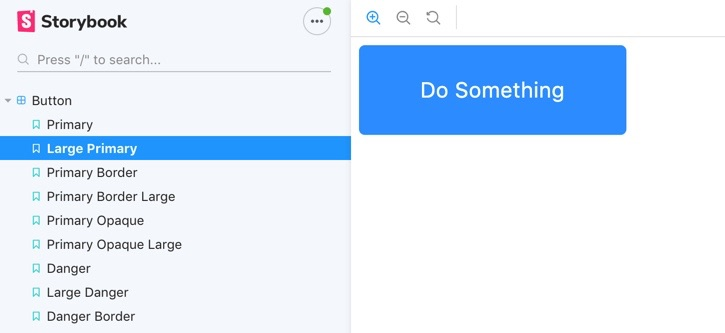

# Storybook Component Library

The goal of this project was to create a reusable library of __React__ components using __Storybook__.  
These components were all replicated from an __Adobe XD__ mockup.  




You can view my component library by going to [this __Netlify__ page](https://stupefied-wescoff-981e2b.netlify.com/?path=/story/button--primary).


If you'd like to use these components you can [install them from __NPM__](https://www.npmjs.com/package/tyler-eikenberg-components).

```
npm i tyler-eikenberg-components
```
